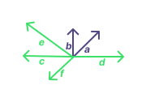
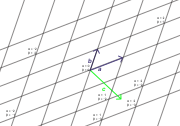
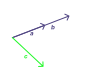

# CONTENTS

- [Linear Decomposition](#linear-decomposition)
- [Geometric Vectors Decomposition](#geometric-vectors-decomposition)
- [Polynomial Vectors Decomposition](#polynomial-vectors-decomposition)
- [$R^n$ Vectors Decomposition](#vectors-decomposition)
- [Linear Systems Are Decomposition Problems](#linear-systems-are-decomposition-problem)
- [Decomposition Might Have No Solution](#decomposition-might-have-no-solution)
    - [Geometric Vectors Case](#geometric-vectors-case)
    - [Polynomial Vectors Case](#polynomial-vectors-case)
    - [$R^N$ Vectors Case](#vectors-case)
- [Linear Property](#linear-property)
    - [Linear Subspace Of Polynomial](#linear-subspaces-of-polynomial)

# LINEAR DECOMPOSITION

- Decomposition is not an act of determining what the final product is made up of 
without any prior knowledge of its forming objects.

- Decomposition is an act of determining how much of each object (like signal, ingredient) 
that you know beforehand makes up the final product.

In linear algebra, if we were to asked to decompose a vector ***c*** without any context 
this would be impossible to do. But if were asked to figure out ***c*** as linear 
combination of ***a*** and ***b***, that we can do. Then we would just have to figure 
out the unknown coefficients $\alpha$ and $\beta$.


## Geometric Vectors Decomposition

Example 1:
Decompose vectors ***c***, ***d***, ***e*** and ***f*** on basis of vectors ***a*** and ***b***.



Visually we can solve them as:

```math
\begin{aligned}
c &=  2a - 2b  \\
d &= -2a + 3b  \\
e &= -2a + 2b  \\
f &= -1a + 0b
\end{aligned}
```

In General, we can visualize the construction of an **Affine Grid**:
- A Cartesian coordinate grid is equally spaced grid in both x and y direction
- An Affine grid is skewed Cartesian coordinate grid
- An Affine grid doesn't need to to equally spaced grid in both x and y direction
- An Affine grid is equally spaced in a single direction.

Using straight line construction visualization of two vectors, we can visualize 
an affine grid like in figure below:



We can then say: 
```math
\begin{aligned}
c &= (\frac{1}{2} + \alpha) a + (\frac{1}{4} + \beta) b
\\
\\
c &= (\frac{1}{2} + 1) a + (\frac{1}{4} - 2) b
\\
\\
c &= \frac{3}{2} a - \frac{7}{4} b
\end{aligned}
```


## Polynomial Vectors Decomposition

Example 1:
Given the polynomials $p_1(x) = x^2$, $p_2(x) = 3x$ and $p_3(x) = 1$, solve followings:

```math
\begin{aligned}

x^2 + 7x + 5\ &= \ ? \ p_1 + \ ? \ p_2 + \ ? \ p_3 \\
              &= \ 1 \ p_1 + \ \frac{7}{3} \ p_2 + \ 5 \ p_3
\end{aligned}
```

```math
\begin{aligned}

x^2 - 7x\ &= \ ? \ p_1 + ? \ p_2 + ? \ p_3  \\
          &= \ 1 \ p_1 - \ \frac{7}{3} \ p_2 + \ 0 \ p_3

\end{aligned}
```

> NOTE: We usually try to solve decomposition of polynomials with bootstrapping method.

> Bootstrapping, in mathematics, is a method useful when in the beginning we only know the 
> first step. Then after that step we get to know new few steps and in this manner solve a 
> complex problem.

> When bootstrapping fails, we use system of linear equations and Gaussian Elimination method.


## $R^n$ Vectors Decomposition

Solving a system of linear equations is equivalent to solving a decomposition problem in $R^n$.
But for following examples, we again will use bootstrapping approach.

Example 1:
```math
\begin{aligned}

a = \begin{bmatrix}
        1  \\
        0
    \end{bmatrix}
\quad
b = \begin{bmatrix}
        2  \\
        1
    \end{bmatrix}

\\
\\

\begin{bmatrix}
    7  \\
    8
\end{bmatrix}
\ &= \ -9a + 8b

\\
\\

\begin{bmatrix}
     3  \\
    -5
\end{bmatrix}
\ &= \ 13a - 5b

\end{aligned}
```

For problem above, we first need to think of coefficient of vector **b** only that vector 
helps up get second entry value of our result vector. Then we think of coefficient of 
vector ***a***. This method of solving is called bootstrapping.


# Linear Systems Are Decomposition Problem

Following system of linear equations:
```math
\begin{aligned}
 x + 2y + 3z + 3t = 12 \\
4x + 5y + 6z + 3t = 45 \\
7x + 8y + 9z + 3t = 78 \\
\end{aligned}
```

Can be represented in real numbers vectors form of $R^3$ as shown below:
```math
\begin{bmatrix}
    12  \\
    45  \\
    78
\end{bmatrix}
\ = \ x
\begin{bmatrix}
    1  \\
    4  \\
    7
\end{bmatrix}
\ + \ y
\begin{bmatrix}
    2  \\
    5  \\
    8
\end{bmatrix}
\ + \ z
\begin{bmatrix}
    3  \\
    6  \\
    9
\end{bmatrix}
\ + \ t
\begin{bmatrix}
    3  \\
    3  \\
    3
\end{bmatrix}
```

As we can see this is now a decomposition problem.


# Decomposition Might Have No Solution

Until now we have solved decomposition problems with only one unique solution.
But decomposition problem can have no solution or infinitely many solutions.
Here we will talk about decomposition problem with no solutions.


### Geometric Vectors Case



Geometry vector ***c*** cannot be obtained as the linear combination of vectors ***a*** 
and ***b*** because vectors ***a*** and ***b*** are linearly dependent. That is the 
span(***a***, ***b***) is a 1D line and not a 2D plane. Since vector ***c*** doesn't lie on 
the line spanned by vectors ***a*** and ***b***, the problem has no solution.


### Polynomial Vectors Case

```math
\begin{aligned}

x^2 + 1 \ &= \ ? \ (x^2 + x) \ + \ ? \ (3x^2 - 11x) \ + \ ? \ (7x^2 - x)  \quad ...... \ (i)  \\
x^2 + 1 \ &= \ ? \ (x - 1) \ + \ ? \ (x^2 - 1) \ + \ ? \ (x^2 - 2x + 1)   \quad ...... \ (ii) \\
x^2 + 1 \ &= \ ? \ (x^2 - 4) \ + \ ? \ (3x - 6) \  + \ ? \ (x^2 - 4x + 4) \quad ...... \ (iii) 

\end{aligned}
```

Eqn($i$) doesn't have solution because we cannot get the constant term 1. All the polynomials 
involved the equation can only produce other polynomials with zero free term. That's the 
subspace produce but the target polynomial has 1 in its free term so it doesn't lie on the 
same subspace.

In eqn($ii$), the coefficients of the polynomials add up to zero for $x\ =\ 1$. Since the 
involved polynomials have root at 1 and target polynomial doesn't have root at 1, they lie 
in different subspace. So, no solution here.

Eqn($iii$) is similar to the case of eqn($ii$) for $x\ =\ 2$. So any linear combination of 
given polynomials will result in a polynomial where $x\ =\ 2$ is one of the roots. That is 
the characteristics of the subspace they span. But the target polynomial doesn't have root 
at $x\ =\ 2$. Hence, the problem has no solution.


### $R^n$ Vectors Case


```math
\begin{bmatrix}
    3  \\
    4  \\
    7
\end{bmatrix}
\ = \ ?
\begin{bmatrix}
    1  \\
    0  \\
    7
\end{bmatrix}
\ + \ ?
\begin{bmatrix}
   -7  \\
    0  \\
    5
\end{bmatrix}
\ + \ ?
\begin{bmatrix}
    4  \\
    0  \\
    11
\end{bmatrix}
```

In above problem, we can see the vectors given have their second entry value as 0. But the 
target vector have second entry as non-zero element. Since all linear combinations of given 
vectors can only cover a 2D subspace where second entry is always 0, the target vector lies 
on different subspace. Hence no solution can be found.


```math
\begin{bmatrix}
    3  \\
    4  \\
    7
\end{bmatrix}
\ = \ ?
\begin{bmatrix}
    3   \\
    15  \\
    7
\end{bmatrix}
\ + \ ?
\begin{bmatrix}
   -4  \\
   -20  \\
    3
\end{bmatrix}
\ + \ ?
\begin{bmatrix}
    1  \\
    5  \\
    17
\end{bmatrix}
```

In above problem, we can see that second entry is always 5 times the first entry. But this is 
not the case with the target vector. Hence, the target vector doesn't fall on the same 
subspace created by the given vectors so no possible solution.


```math
\begin{bmatrix}
    3  \\
    4  \\
    7
\end{bmatrix}
\ = \ ?
\begin{bmatrix}
    1  \\
    2  \\
    3
\end{bmatrix}
\ + \ ?
\begin{bmatrix}
    4  \\
    5  \\
    6
\end{bmatrix}
\ + \ ?
\begin{bmatrix}
    7  \\
    8  \\
    9 
\end{bmatrix}
```

In above problem, we can detect the pattern that second entry is the average of first and 
third entries. So the subspace spanned by them will also have that property. But the target 
vector doesn't have that property. Hence the target vector cannot be produced by the linear 
combination of given vectors.

# Linear Property

> OBSERVATION: Linear property is synonymous to the linear subspace spanned. Meaning the 
> same property can be seen in result of linear combination of similar vectors.
> This has helped us prove existence of no solution for above decomposition problems.

- For a property to be a linear property, it must satisfy all following statements:
    - Multiplication by a scalar yields the vector of same property.
    - Adding two or more vectors of same linear property yields another vector of same property.
- So basically, the linear property must be closed under linear combination.
- All linear property can be described by the help of a common template:
    - TEMPLATE: Linear combination of coefficients (only interested ones) equals zero.
- To see the template in the given problems of $R^n$ vectors, let general vector be 
  ($\alpha$, $\beta$, $\gamma$):
    - In first problem: $\beta = 0$, this is simplest.
    - In second problem: $\beta = 5\alpha$, rearranging we get $5\alpha - \beta = 0$.
    - In third problem: $\beta = \frac{\alpha + \gamma}{2}$, rearranging we get 
      $2\beta - \alpha - \gamma = 0$.
    - If we substitute ($\alpha$, $\beta$, $\gamma$) by respective value, the linear 
      combination evaluates to zero.


## Linear Subspaces of Polynomial

The possibilities of linear properties for polynomials are much greater than that of $R^n$ 
because the space of functions is much richer.

> CAUTION: Unlike in $R^n$ vector space, functions vector space doesn't have any 
> template for linear property that describes all linear properties because it is 
> much more complicated (we can talk about graphs, roots, derivatives, integrals, ...).

Following are some of the linear properties for the functions:

```math
\begin{aligned}

f(x) &= 0
\\
\\

\int_0^1 f(x) dx &= 0
\\
\\

3 f(x)^{"} - f(x)^{'} &= 0

\end{aligned}
```

> NOTE: The RHS should always equal to zero for it to be a linear property.

> ENLIGHTENMENT: If we narrow down to only polynomials, we can again find a template 
> in terms of coefficients that can help all linear properties to be described.


Lets consider the Quadratic Polynomials:

```math
\alpha x^2 + \beta x + \gamma = 0
```

TEMPLATE: Linear combination of the coefficients (only related ones) must equal to zero.

Below, it can be seen how each linear property is translated to some type of condition 
on coefficients.

```math
\begin{aligned}

f(x) &= 0 \qquad \alpha + \beta + \gamma = 0
\\
\\

\int_0^1 f(x) dx &= 0 \qquad \frac{1}{3} \alpha + \frac{1}{2} \beta + \gamma = 0
\\
\\

3 f(x)^{''} - f(x)^{'} &= 0 \qquad 2 \alpha = 0 \quad \text{and}\quad 6 \alpha - \beta = 0
\\ \qquad f(x)^{'} = 2 \alpha x + \beta \quad f(x)^{"} = 2 \alpha

\end{aligned}
```

> NOTE: Third case is INTERSECTION of subspace.
