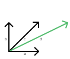

# CONTENTS

- [Linear Dependence](#linear-dependence)
- [Linear Independence](#linear-independence)


# Linear Dependence

Definition 1: \
A set of vectors is linearly dependent if at least one of the vector is a linear combination of 
the other vectors.

> NOTE: Vectors are linearly dependent also when there exists some linear property. This is 
> because the subspace spanned by such vectors has less dimension than the dimension of the 
> space it exists in. In other words, the subspace formed is a proper subspace that doesn't 
> span the whole space.



In case of a linear dependence, a linear decomposition problem can have more that one solution 
and possibly infinitely many solutions. For instance, in diagram above, $c = a + b$ and vector 
***d*** has many possible solutions like $d = 2a + b$ or $d = a + c$ or $d = -b + 2c$ and so on.

For the problem of finding linear combination of vector ***d*** in figure above, we can express 
the all possible solutions of vector ***d*** with following observations:

We can see $c = a + b$, now
```math
\begin{aligned}

d &= 2a + 1b + 0c  \\
  &= (2 + \alpha) a + (1 + \alpha) b - \alpha c  \\
  &= 2a + b + \alpha (a + b - c)

\end{aligned}
```

The term $\alpha (a + b - c)$ evaluates to zero vector because of $c = a + b$.
Although this doesn't change the value obtained, that is vector ***d***, it changes the 
expression itself leading to infinitely many linear combinations as the solution.

Definition 2: \
The set of vectors is linear dependent if there exists as non-trivial linear combination 
of the vectors that equal zero. In above example, we had the linear combination equal zero 
show by equation $c = a + b$ which evaluates to $a + b -c =$ ***0***.

A trivial linear combination has all its coefficients as zero to get the zero vector as the 
result of linear combimation $0a + 0b =$ ***0***.


# Linear Independence

A set of vectors is linearly independent if none of the vectors is a linear combination of the rest.
Simply put, linear independence exists if there doesn't exist a linear dependence.

> OBSERVATION: Linear independence implies uniqueness. Meaning, there is only one linear combination 
> that can get us to the target vector.
