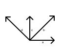

# Null Space



Linear dependency in figure above is captured by equations below:

$b = a + c$ \
$d = c - a$

Rearranging them to be non-trivial linear combination:
```math
\begin{aligned}

a - b + c \qquad = \vec{0} \\
a \qquad - c + d = \vec{0}

\end{aligned}
```

- Linear combinations that equals to zero vector can be thought of as vectors themselves.
    - We can add them together and get new linear combination that equals zero.
    - We can multiply by scaler and get new linear combination that equals zero.
- These linear combinations that equals to zero vector basically forms a subspace.
- The formed subspace is the zero vectors itself.
- This subspace is also called **Null Space**.
- It is $0^{th}$ dimension subspace of any $R^n$ vectors
    - because linear combination is about finding coefficients of vectors
    - and we can represent coefficients as a vector in form $R^n$.

We can represent the equations as $R^4$ vectors linear combination:
```math
\alpha \begin{bmatrix}
  1 \\
 -1 \\
  1 \\
  0
\end{bmatrix}
+
\beta \begin{bmatrix}
  1 \\
  0 \\
  1 \\
  1
\end{bmatrix} = \vec{0}
```

- Concept of Null Space is crucial in solving linear equations
    - because if the given target vector is from same subspace
    - then essentially it introduces linear dependency
    - with linear dependency we can rearrange the linear combination equation
    - to yield zero vector as result and gets us to Null Space

