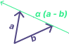
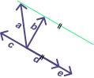

# CONTENTS

- [Linear Combination](#linear-combination)
- [Span](#span)
- [Spanning Set](#spanning-set)
- [Dimension](#dimension)
- [Basis](#basis)
- [Linear Combination Observation: Coefficients Constraining](#linear-combination-observation-coefficients-constraining)
- [Linear Combination Observation: Straight Line Equation](#linear-combination-observation-straight-line-equation)


# Linear Combination

Linear combination is an expression where vectors are multiplied by scalar (called 
coefficients) and added together.

$\alpha$***a*** + $\beta$***b***

Above expression shows the linear combination of vectors ***a*** and ***b*** and the 
coefficients are $\alpha$ and $\beta$.

Some important terms like Closure and Vector Space are also related to linear combination:
- Vector space (aka linear space)
     - this is totality of all vectors of same kind (same dimension)
     - that can go under linear combination and produce another vector of same kind
     - meaning the space cannot be escaped with linear combination operations
- Vectors are closed under linear combination
    - meaning, adding two vectors or multiplying a vector by a scalar
    - will result in a new vector of same vector space
    - this is known as Closure


# Span

- Span can work with any number of vectors (zero, one, two, ...).
- Span is the set of all possible linear combinations.
- Span(***a***, ***b***), span of ***a*** and ***b***, means:
    - set of all possible linear combinations of ***a*** and ***b***
    - where the coefficients $\alpha$ and $\beta$ can have any real value
    - this essentially spans a subspace that is: the whole 2D plane area
    - (given that they are linearly independent)
    - given that both vectors doesn't share zero element for same entry
    - for example: (3, 0, 7) and (7, 0, 11)
    - if any element is zero, the span only covers subset of the subspace


## Spanning Set

Spanning set is a set of vectors that can express any other vector in the same vector space 
by a linear combination.

- Set of vectors whose linear combination spans whole space and not just some subspace.
- For example, (1, 2, 3) and (6, 1, 7)
    - these two vectors linear combination spans whole space of 2D plane
    - hence they are the spanning sets
- Adding new vectors to existing spanning set is also spanning set
- Any spanning set with the fewest number of vectors is linearly independent.


# Dimension

Dimension is the cardinality of linearly independent spanning sets.

All linearly independent spanning sets, regardless of its construction, has same number of vectors. 
For example, linearly independent spanning set $S$ in $R^2$ space has $|S| = 2$ hence, the dimensions 
is 2. In general, linearly independent spanning set $S$ in $R^n$ space has $|S| = n$ so $n$ dimensions.


# Basis

A basis is a set where linear independence meets the property of the spanning sets.
A basis can express any vector in its dimension uniquely.

We can take cardinality of basis set to find the dimension of the space.


## Linear Combination Observation: Coefficients Constraining

> OBSERVATION: Constraining coefficients of Linear combination of two vectors results
> in a straight line.

Constraint: $\alpha + \beta = 1$



```math
\begin{aligned}
Eqn &= \alpha a + \beta b \\
    &= \alpha a + (1 - \alpha) b \\
    &= \alpha a + b - \alpha b \\
    &= b + \alpha (a - b) \\
\end{aligned}
```

To describe the above observation for a linear combination of ***a*** and ***b***,
we constraint the components to satisfy the equation: $\alpha + \beta = 1$.
We can restructure the equation to be $\beta = 1 - \alpha$. Then the linear 
combination equation can be restructured and the resulting vector is a straight line.

## Linear Combination Observation: Straight Line Equation

> OBSERVATION: Vectors can define equation of a straight line that doesn't go through origin
> as a linear combination of some two vectors.



- We get to the line with any vector whose tip lies on the line.
- And we can move along the line by scaling the vector that is parallel to the line.

Below are the list of linear combination that can yeild same straight line.
Notice that we can achieve same straight line with different set of vectors.

$a + \alpha c$ \
$a + \alpha d$ \
$a + \alpha e$ \
$b + \alpha c$ \
$b + \alpha d$ \
$b + \alpha e$

Steps to know vectors that will be used for forming equation:
- Take a vector parallel to the straight line, direction can be different
    - from the diagram, the vectors can be any of ***c***, ***d***, ***e***
    - the parallel vector has coefficient to scale the vector
- Take another vector that touches the straight line
    - from the diagram, that can be ***a*** or ***b*** or any other like them
    - this vector stays constant that is no coefficient
- Any one of the above linear combination can be used a equation for the straight line.

