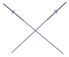

# CONTENTS

- [Subspace](#subspace)
- [Unions Of Linear Subspace](#unions-of-linear-subspace)
- [Intersection Of Linear Subspace](#intersection-of-linear-subspace)

# SUBSPACE

A subspace is any vector space (for any type of vector like geometric, polynomial, $R^n$) that 
has following properties:

- closed under addition
- closed under multiplication
- contains the zero vector

## Unions Of Linear Subspace

Consider a subspace of 1D line in 2D geometric vector space.

The Union of two lines is the combination of show two lines. For a vector to be considered 
union, it must belong to one of he two lines.

We can make following notes for the union:
- In order to be the union, the vector needs to belong on those two lines.
- The vectors are closed under multiplication
    - multiplying by scaler to any of vector from two lines still falls on one of two lines.
- But the vectors are not closed under addition.
    - target vector doesn't always fall on the shown two lines.

> CONCLUSION: Therefore, union of vectors in not a subspace.

## Intersection Of Linear Subspace

The intersection of linear subspace of two 1D lines in a 2D geometric plane is the zero vector.

Zero vector is itself a subspace because:
- it is closed under addition
- it is closed under multiplication
- it contains the zero vector

Lets consider slightly more richer situation:

With reference to above picture, lets consider the intersection of two 2D planes. Their 
intersection would be a 1D line passing through the origin.

This 1D line has property of subspace: closed under linear combination and passes 
through origin.

- Addition of $v_1$ and $v_2 \in \cap$ is closed, that is, new vector belongs to same line.
- Multiplication of $v \in \cap$ by a scalar is closed, that is, new vector belongs to same line.

> CONCLUSION: Therefore, intersection of vectors is a subspace.
