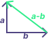

# CONTENTS

- [Vector](#vector)
- [Properties Of Vector](#properties-of-vector)
- [Vector Addition Geometric Visualization](#vector-addition-geometric-visualization)
- [Vector Scaling Geometric Visualization](#vector-scaling-geometric-visualization)
- [Vector Subtraction Geometric Visualization](#vector-subtraction-geometric-visualization)
- [Polynomial Are Vectors Too](#polynomials-are-vectors-too)
- [$R^n$ As Vector](#as-vector)
- [References](#references)

# Vector

The term vector in Linear Algebra is derived from Geometry along with other terms 
like space, subspace, plane, dot product, etc.
In Geometry, a vector is a directed segment.

For linear algebra, the vector is an ordered tuple of real numbers that can be 
added together ***a*** + ***b*** = ***c*** or scaled by a scalar 
$\lambda$***a*** = ***c*** to form a **new vector**. Also they have certain mathematical
properties.

> NOTE: vectors for linear algebra doesn't share same difinition of geometric vector
> where they are required to have a direction and magnitude both.

> GEOMETRIC OBSERVATION: Two vectors together can define a whole 2D plane because the 
> resultant vector formed by adding and scaling those two vectors lie on the same plane.
> BUT, for this to hold true, those two vectors most be in same plane and linearly 
> independent.

Many things in real life can be vectors:
- Geometric vectors
    - displacement
    - velocity
    - acceleration
- Polynomial equations
- Sound Waves
- List of numbers

## Properties Of Vector

1. Commutativity
 ***a*** + ***b*** = ***b*** + ***a***
2. Associativity
 (***a*** + ***b***) + ***c*** = ***a*** + (***b*** + ***c***)
3. Distributivity
 $\lambda$(***a*** + ***b***) = $\lambda$***a*** + $\lambda$***b***

## Vector Addition Geometric Visualization

In linear algebra, all vectors of interest are considered to emanate from a point 
(this point is called the origin). This is unlike physics where vectors are not confined 
to emanate from the origin. This affects the visualization of vectors addition.

***a*** + ***b*** = ***c***

From physics viewing point, we can move the bottom of ***b*** and put it on the tip of 
***a***. Then, the resultant vector ***c*** is the segment going from bottom of ***a*** 
to the tip of ***b***.

From linear algebra viewing point, since we cannot move the vector away from its origin, 
we draw a parallelogram by sketching a line form tip of ***a*** parallel to ***b*** 
and another line from tip of ***b*** parallel to ***a***. Then, the resultant vector ***c*** 
will be the segment going from origin to intersection point of the two parallel lines.

> CAUTION: the parallelogram method of visualization doesn't work in 1D space.

## Vector Scaling Geometric Visualization

For a positive scalar, the direction remains same and only the magnitude changes.

For a negative scalar, the direction inverts and magnitude changes.

Special scalars are ±0, +1 and -1 where vector vanishes or stays same or only inverts 
direction respectively.

## Vector Subtraction Geometric Visualization

A familiar visualization for vectors subtraction can be formed by first inverting the 
negative vector, which makes the negative vector face the positive direction, then 
following the visualization of vector's addition.

Another intuition can be drawn from algebra, that is \
 ***a*** - ***b*** \
         + ***b*** \
-------------------\
 ***a***

To geometrically view above algebraic operations, ***a*** - ***b*** is basically a 
segment going from the tip of ***b*** to the tip of ***a*** where both the vectors 
***a*** and ***b*** are emanated form same origin.

> Why go from negative vector's tip to positive vector's tip (for a - b)?

> Because if we go from positive's tip we get: a + (a - b) = 2a - b ≠ a - b.\
> Hence, going from negative's tip we get: b + (a - b) = a - b, the desired vector.

## Polynomials Are Vectors Too

For geometric vector, adding and scaling two linearly independent 2D vectors covers whole 
2D plane and this is called subspace for those vectors.

For polynomials, if two polynomials of highest degree up to $p$ is added and scaled then 
the resultant polynomial also has power up to $p$.

The subspace for polynomial vectors can be understood as following:
- Consider a subset of polynomials of any degree with property that
    - all such polynomial shares a common root
    - to have a root also means that the coefficients of polynomial evaluates to zero
- Then mutiplication by scalar and addition of polynomials from that group
    - results in a polynomial that belongs in same group
    - meaning the resulting polynomical also share the same root

# $R^n$ As Vector

Ordered tuple of real numbers are the vectors we extensively deal in linear algebra.
They satisfy the addition and multiplication operation rule and they also follow the 
three mathematical properties of vector.

The subspace analogy for these vetors can be that linear combination of vectors from 
$R^3$ will give another vetor in $R^3$. When it comes to these vector, we can only talk 
about their element's entry or the dimension of the vector.

